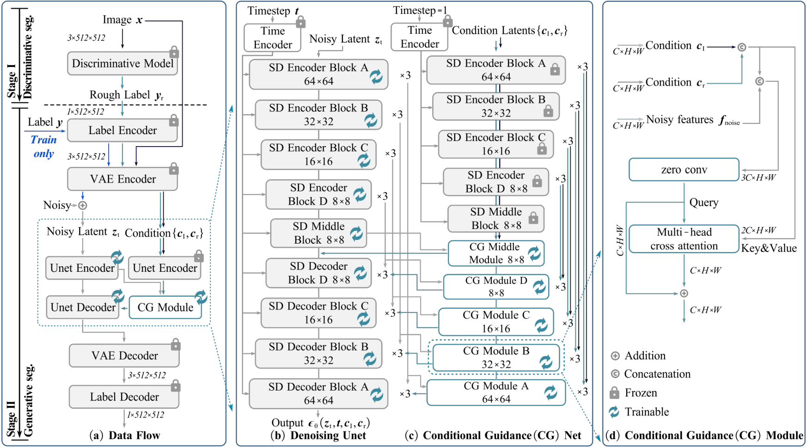
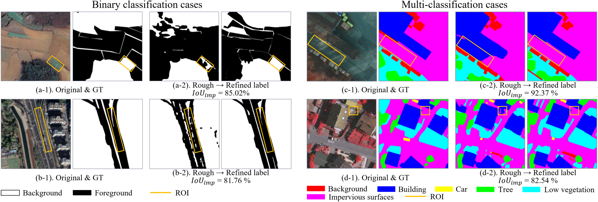
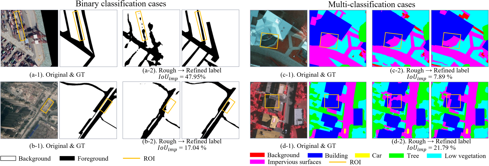
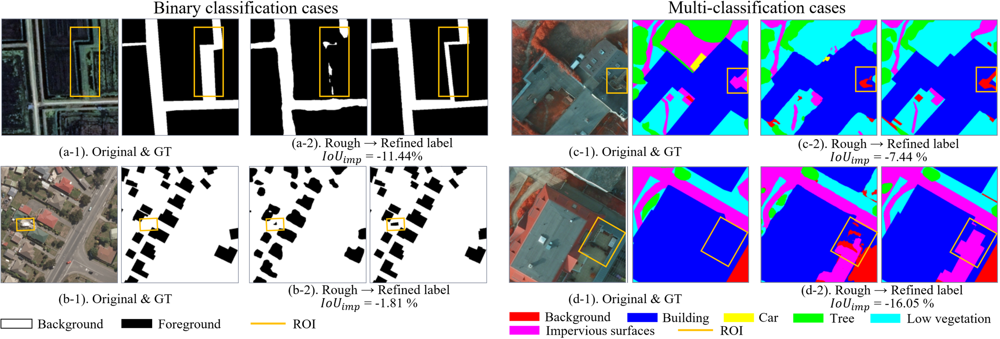

<h1 align="center">A Gift from the Integration of Discriminative and Diffusion-based Generative Learning: Boundary Refinement Remote Sensing Semantic Segmentation</h1>

<p align="center">
  <a href="https://orcid.org/0000-0002-3964-479X">Hao Wang</a><sup>1,2</sup>, <a href="https://orcid.org/0000-0003-0168-5606">Keyan Hu</a><sup>1</sup>, <a href="https://orcid.org/0009-0009-6154-120X">Xin Guo</a><sup>1</sup>, <a href="https://orcid.org/0000-0003-1173-6593">Haifeng Li</a><sup>1</sup>, <a href="https://orcid.org/0000-0003-0071-310X">Chao Tao</a><sup>1*</sup>
</p>
<p align="center">
  <sup>1</sup> CSU &nbsp;&nbsp; <sup>2</sup> IMU
</p>
<p align="center">
  * Corresponding author.
</p>

<p align="center">
  <a href="https://arxiv.org/abs/2507.01573"></a>
  <a href="https://github.com/KeyanHu-git/IDGBR"></a>
  
  
</p>

---

## :sparkles: Overview
Remote sensing semantic segmentation requires both semantic correctness over large regions and precise localization along object boundaries. Existing discriminative methods model low-frequency semantic structure well, but often miss high-frequency boundary details. Diffusion-based generative models show the opposite tendency: they are strong at fine-grained detail synthesis, yet weaker at stable semantic inference when conditioned only on raw images. IDGBR bridges this gap by combining discriminative coarse segmentation with diffusion-based boundary refinement, using the former for reliable semantic priors and the latter for boundary recovery.

The figure below highlights this complementarity and motivates the design of IDGBR.

<p align="center">
  
</p>

**Best Suited For**
- Refining coarse segmentation masks with sharper and cleaner boundaries
- Binary or multi-class remote sensing segmentation tasks, such as roads, buildings, and land-cover objects

## 📑 Table of Contents
- [Model Architecture](#model-architecture)
- [Visualization](#visualization)
- [Training steps](#training-steps)
- [Inference steps](#inference-steps)
- [Preparing the Datasets](#preparing-the-datasets)
- [Pretrained Weights](#pretrained-weights)
- [Environment Requirements](#environment-requirements)
- [Acknowledgements](#acknowledgements)
- [Citation](#citation)

## Model Architecture
IDGBR follows a two-stage framework that combines discriminative coarse segmentation with diffusion-based boundary refinement. Rather than regenerating the entire semantic layout, it preserves the global semantics provided by the coarse prediction and focuses on refining boundary details and local geometric structures.

The discriminative branch is responsible for semantic localization, while the diffusion branch is dedicated to boundary refinement. In **Stage I**, a frozen discriminative model produces a rough prediction $M_r$ as the semantic prior. In **Stage II**, the image and rough prediction are jointly fed into the latent diffusion process, where the **Denoising U-Net** and **Conditional Guidance (CG) Net** work together to recover finer boundaries.

<p align="center">
  
</p>

## Visualization
To characterize the practical repair capability of the model on rough predictions, we categorize its behavior into three levels—Complete Repair, Partial Repair, and Error Repair—and illustrate each case with representative examples.

<p align="center">
  
</p>
<p align="center">Complete repair example: local errors in the rough prediction are effectively corrected while the correct regions remain stable</p>

Complete Repair ($IoU_{imp}\ge80\%$) represents efficient correction of erroneous regions while perfectly preserving the features of correct regions. This case typically occurs when a semantic patch contains only local omissions or commissions, allowing the model to infer the complete geometry and structure of the target from the remaining correct semantic context.

<p align="center">
  
</p>
<p align="center">Partial repair example: the erroneous region is locally improved, but the full geometric structure of the target is not completely recovered</p>

Partial Repair ($0\le IoU_{imp}<80\%$) indicates effective repair of some errors without causing severe damage to correct features. This usually occurs when the retained correct region only provides local geometric continuity, but lacks sufficient prior cues to recover the full width, length, or overall shape of the target, resulting in only local semantic and topological correction.

<p align="center">
  
</p>
<p align="center">Error repair example: the damage to correct regions outweighs the repair benefit on erroneous regions</p>

Error Repair ($IoU_{imp}<0$) implies that the damage to correct regions outweighs the repair benefits. When a target semantic patch is completely missed or misclassified and no reliable cues can be inferred from neighboring regions, the model struggles to recover such deep semantic errors and may even result in negative optimization due to misleading localization cues.

The quantitative metric for this repair capability is constructed from the spatial discrepancy between the rough prediction $M_r$ and the ground truth $M_t$. Specifically, the rough prediction space is first divided into the mask of True predicted Region and the mask of False predicted Region:

True predicted Region:

$$
M_{RTm} = M_t \cap M_r
$$

False predicted Region:

$$
M_{RFm} = (M_t \cup M_r) - (M_t \cap M_r)
$$

The intersection-over-union (IoU) of the refined prediction $M_{re}$ is then computed separately within these two specific regions:

$$
IoU_{RTm} = \frac{|M_t \cap M_{re} \cap M_{RTm}|}{|(M_t \cap M_{RTm}) \cup (M_{re} \cap M_{RTm})|}
$$

$$
IoU_{RFm} = \frac{|M_t \cap M_{re} \cap M_{RFm}|}{|(M_t \cap M_{RFm}) \cup (M_{re} \cap M_{RFm})|}
$$

$IoU_{RTm}$ measures the model's capability to preserve true predicted regions; an excessively low value indicates significant degradation of correct regions. $IoU_{RFm}$ evaluates the model's ability to rectify false predicted regions, where a positive value indicates effective repair. Integrating both preservation and rectification capabilities, we define the final improvement score $IoU_{imp}$ by introducing a penalty term $k$ to balance their weights:

$$
IoU_{imp} = IoU_{RFm} - k \times (1 - IoU_{RTm})
$$

## Training steps
```
bash scripts/train.sh configs/experiments/CHN6-CUG/segformer.yaml 0
```

## Inference steps
Inference:
```
bash scripts/inference.sh configs/inference/CHN6-CUG/segformer.yaml 0
```
Evaluation:
```
python -m evaluation.evaluate --config evaluation/configs/CHN6-CUG/segformer_001.yaml
```

## Preparing the Datasets
Place datasets under `examples/`. Training and inference samples are indexed by `metadata_i2s_*.jsonl`, with paths defined relative to `examples/<dataset>/`. The expected directory structure is:
```
examples/
├── CHN6-CUG/
│   ├── metadata_i2s_segformer_train.jsonl
│   ├── metadata_i2s_segformer_test.jsonl
│   ├── train/
│   │   ├── images/
│   │   ├── labels/
│   │   └── rough_labels/
│   └── test/
│       ├── images/
│       ├── labels/
│       └── rough_labels/
├── Potsdam/
│   ├── metadata_i2s_segformer_train.jsonl
│   ├── metadata_i2s_segformer_test.jsonl
│   ├── images_IRRG/
│   │   ├── train/
│   │   └── test/
│   ├── label_index/
│   │   ├── train/
│   │   └── test/
│   └── rough_label_index_segformer/
│       ├── train/
│       └── test/
├── ...
```

## Pretrained Weights
All model paths in the configs are resolved under `weight/`.

- `weight/stable-diffusion-v1-5`: Stable Diffusion v1.5 checkpoint in Diffusers format. Official repository: [CompVis/stable-diffusion](https://github.com/CompVis/stable-diffusion). Model download: [stable-diffusion-v1-5/stable-diffusion-v1-5](https://huggingface.co/stable-diffusion-v1-5/stable-diffusion-v1-5).
- `weight/DINOv2/dinov2_vit_g14.pth`: DINOv2 ViT-g/14 backbone checkpoint. Official repository: [facebookresearch/dinov2](https://github.com/facebookresearch/dinov2). Official checkpoint: [dinov2_vitg14_pretrain.pth](https://dl.fbaipublicfiles.com/dinov2/dinov2_vitg14_pretrain.pth). Hugging Face reference: [facebook/dinov2-giant](https://huggingface.co/facebook/dinov2-giant).
- `weight/labelembednet2`: provided in this release for the binary datasets used in this paper, including `CHN6-CUG`, `FGFD`, and `WHU-Building`.
- `weight/labelembednet8`: provided in this release for the multi-class settings used in this paper, including `Potsdam` and `Vaihingen`.

The released checkpoints already cover the 2-class and 8-class settings used in this project. If your label taxonomy uses a different number of classes, edit `configs/label_embed/label_embed_xclass.yaml` and set at least `num_classes`, `output_dir`, and `tracker_project_name`, then run:

```bash
bash scripts/train_label_embed.sh configs/label_embed/label_embed_xclass.yaml 0
```

The output directory is:

- `configs/label_embed/label_embed_xclass.yaml` -> `weight/labelembednet_xclass`

## Environment Requirements
```
conda create -n IDGBR python=3.10.14
conda activate IDGBR
pip install -r requirements.txt
```

`requirements.txt` includes the platform-sensitive dependencies required by the released codebase, including `bitsandbytes`, `xformers`, `mmcv-full`, `mmcls`, `mmsegmentation`, and `submitit`. The environment above is validated on Linux with CUDA 11.7 and PyTorch 2.0.1; other CUDA, PyTorch, or operating-system combinations may require dependency adjustments.

## Acknowledgements
We thank the authors and maintainers of [Stable Diffusion](https://github.com/CompVis/stable-diffusion), [Diffusers](https://github.com/huggingface/diffusers), [Transformers](https://github.com/huggingface/transformers), [DINOv2](https://github.com/facebookresearch/dinov2), [MMCV](https://github.com/open-mmlab/mmcv), and [REPA](https://github.com/sihyun-yu/REPA) for releasing open-source code, pretrained models, and research resources that informed this project.  

## Citation
If you find IDGBR helpful, please consider giving this repo a ⭐ and citing:

```
@article{wang2026idgbr,
  title={A Gift from the Integration of Discriminative and Diffusion-based Generative Learning: Boundary Refinement Remote Sensing Semantic Segmentation},
  author={Wang, Hao and Hu, Keyan and Guo, Xin and Li, Haifeng and Tao, Chao},
  journal={IEEE Transactions on Pattern Analysis and Machine Intelligence},
  year={2026},
  doi={10.1109/TPAMI.2026.3654243}
}
```
